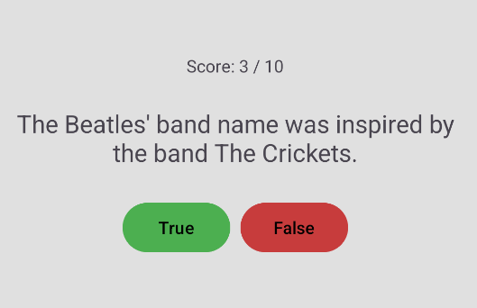

# True or False Quiz

# A simple Android quiz app written in Kotlin. It loads true/false questions from the [Open Trivia DB](https://opentdb.com) API and keeps track of the score.

## Features

- Fetches 10 true/false questions from the API
- Shows one question at a time with True and False buttons
- Live score and final score
- Decodes HTML entities in the question text

## API

Endpoint used:

```
https://opentdb.com/api.php?amount=10&type=boolean
```

## Project structure

```
app/src/main
├── AndroidManifest.xml
├── java/com/example/quiz
│   ├── MainActivity.kt
│   ├── TriviaApi.kt
│   └── TriviaModels.kt
└── res
    ├── layout/activity_main.xml
    └── values
        ├── colors.xml
        └── strings.xml
```

Create `TriviaApi.kt` and `TriviaModels.kt` as **Kotlin Files** (not Classes). Keep the `package` line that Android Studio generates at the top of each file.

## Setup

### Internet permission

`AndroidManifest.xml`, before the `<application>` tag:

```xml
<uses-permission android:name="android.permission.INTERNET" />
```


## How it works

1. `onCreate` calls `loadQuestions()`, which makes the request inside a coroutine so the UI does not freeze.
2. Retrofit converts the JSON into Kotlin objects (`TriviaResponse`).
3. The buttons start disabled and are enabled once the questions arrive.
4. Each click compares the user's answer with `correct_answer`, updates the score, and moves to the next question.
